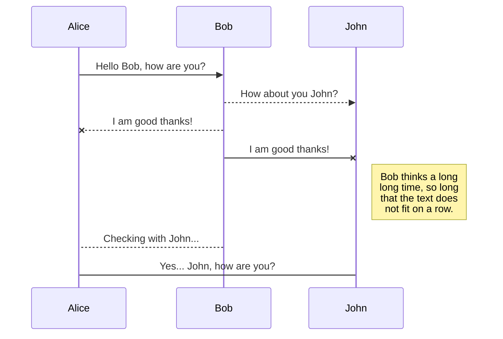

# Gym Tool
Práctica de la asignatura de **Aplicaciones Distribuidas** desarrollada con SpringBoot y MySQL.

## Descripción
Es una aplicación web que ofrece servicios de gestión de un gimnasio. Desde el punto de vista de venta, ofreciendo un contenido personal con el objetivo de monitorizar su entrenamiento.

**Funcionalidad Pública**
El usuario sin hacer Log In podrá realizar la siguiente funcionalidad:
 - Consultar Rutinas Free, ciertas rutinas están abiertas al público y no es necesario ser cliente del gimnasio.
 - Darse de alta en una Subscripción

**Funcionalidad Privada**
El usuario que se ha registrado en el gimnasio podrá:
 - Consultar las Rutinas disponibles en esa Subscripción
 - Establecer Rutinas Favoritas
 - Descargar Rutinas en formato PDF o Word (valorar formato) a través de otra aplicación de Servicio Interno
 - Consultar las Clases disponibles
 - Apuntarse a Clases
 - Descargar Horario de Clases Apuntadas en formato PDF o Word a través de otra aplicación de Servicio Interno
 
## Entidades Principales

**Usuario**: Entidad que almacena los datos del usuario del gimnasio.
 - ID
 - Nombre
 - Apellido
 - Contraseña
 - Subscripción
 - Rutinas Favoritas
 - Rutina Actual

**Subscripción**: Define el tipo de subscripción contratada en el gimnasio del usuario. Esto define las Salas disponibles y las Rutinas disponibles del cliente.
 - ID
 - Nombre
 - Costes
 - Descripción
 - Lista de Salas Disponibles
 - Lista de Rutinas Disponibles
 - Fecha de Contratación

**Sala**: Define cada sala del gimnasio. 
 - ID
 - Nombre
 - Descripción
 - Número de Planta
 - Disponibilidad
 - Es Gratis

**Disponibilidad**: Calendario de fechas disponibles y no disponibles.

**Rutina**: Define cada Rutina disponible para los clientes.
 - ID
 - Nombre
 - Descripción
 - Lista de Salas necesarias para realizarla
 
**Favoritas**: Lista de Rutinas Favoritas de cada usuario.

## Servicio Interno
El servicio interno de Gym Tool ofrece la posibilidad de:

 - Sacar en PDF la Rutina que el usuario indique.
 - Sacar la Lista de Clases que el usuario está apuntado.

## Equipo
|Nombre|Apellidos|Correo electrónico|Github
|--|--|--|--|
|Diego|Díaz Pérez|d.diazp@alumnos.urjc.es|https://github.com/didushow/gym-tool
