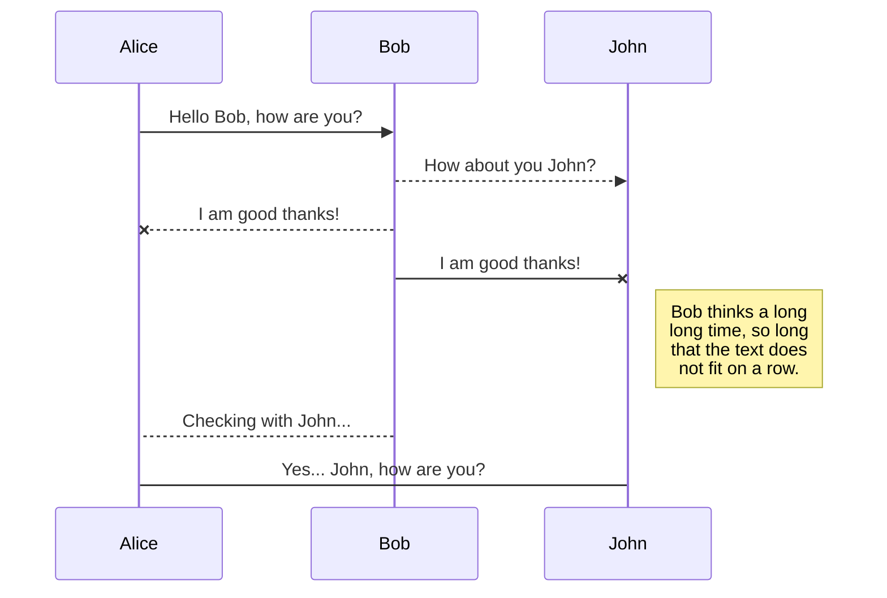

# Gym Tool
Práctica de la asignatura de **Aplicaciones Distribuidas** desarrollada con SpringBoot y MySQL.

## Descripción
Es una aplicación web que ofrece servicios de gestión de un gimnasio. Desde el punto de vista de venta, ofreciendo un contenido personal con el objetivo de monitorizar su entrenamiento.

**Funcionalidad Pública**
El usuario sin hacer Log In podrá realizar la siguiente funcionalidad:
 - Consultar Rutinas Free, ciertas rutinas están abiertas al público y no es necesario ser cliente del gimnasio.
 - Darse de alta como usuario del gimnasio (elegir una subscripción)

**Funcionalidad Privada**
El usuario que se ha registrado en el gimnasio podrá:
 - Cambiar la subscripción elegida
 - Consultar las Rutinas disponibles en esa Subscripción
 - Establecer Rutinas Favoritas
 - Descargar Rutinas en formato PDF o Word (valorar formato) a través de otra aplicación de Servicio Interno
 - Consultar las Clases disponibles
 - Apuntarse a Clases
 - Descargar Horario de Clases Apuntadas en formato PDF o Word a través de otra aplicación de Servicio Interno
 
## Entidades Principales

**Usuario**: Entidad que almacena los datos de un usuario dado de alta en el gimnasio.
 - ID
 - Nombre
 - Apellido
 - Contraseña
 - Número de Tarjeta
 - Imagen de Perfil
 - Subscripción Elegida
 - Lista de Rutinas Favoritas
 - Lista de Clases Apuntadas

**Subscripción**: Entidad que describe una subcripción del gimnasio: Existen varios tipos (Común, Medio, Premium). Cada subscripción tiene un precio y una serie de servicios acorde con el precio.
 - ID
 - Nombre
 - Coste
 - Descripción
 - Lista de Clases Disponibles
 - Lista de Rutinas Disponibles
 - Fecha de Contratación

**Clase**: Define cada clase que ofrece el gimnasio.
 - ID
 - Nombre
 - Descripción
 - Máximo de Usuarios
 - Lista de Usuarios apuntados

**Rutina**: Define cada Rutina disponible para los clientes.
 - ID
 - Nombre
 - Descripción
 - Lista de Entrenamientos de la rutina
 
 **Entrenamiento**: Define cada Entrenamiento disponible para las rutinas.
 - ID
 - Nombre
 - Descripción
 - Lista de Ejercicios
 
 **Ejercicios**: Define cada Ejercicio disponible para los entrenamientos.
 - ID
 - Nombre
 - Descripción
 - Imagen

## Servicio Interno
El servicio interno de Gym Tool ofrece la posibilidad de:

 - Sacar en PDF la Rutina que el usuario indique.
 - Sacar la Lista de Clases que el usuario está apuntado.

## Equipo
|Nombre|Apellidos|Correo electrónico|Github
|--|--|--|--|
|Diego|Díaz Pérez|d.diazp@alumnos.urjc.es|https://github.com/didushow/gym-tool
